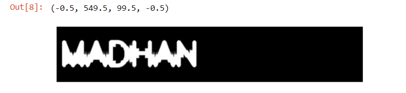

# OPENING--AND-CLOSING
## Aim
To implement Opening and Closing using Python and OpenCV.

## Software Required
1. Anaconda - Python 3.7
2. OpenCV
## Algorithm:
### Step1:
Import the necessary packages

### Step2:
Give the input text using cv2.putText()

### Step3:
Perform opening operation and display the result

### Step4:
Similarly, perform closing operation and display the result

### Step5:
The program should be executed in google colab.
## Program:
## DEVELOPED BY: MADHAN BABU P
## REGISTER NUMBER:212222230075

``` Python
# Import the necessary packages
import numpy as np
import cv2
import matplotlib.pyplot as plt

# Create the Text using cv2.putText
img = np.zeros((100, 550), dtype = 'uint8')
font = cv2.FONT_ITALIC
cv2.putText(img, 'MADHAN', (5,70), font, 2, (255), 5, cv2.LINE_AA)
n_img = cv2.cvtColor(img, cv2.COLOR_BGR2RGB)
plt.imshow(n_img)
plt.axis("off")

# Create the structuring element
kernel = cv2.getStructuringElement(cv2.MORPH_CROSS, (11,11))

# Use Opening operation
image_open = cv2.morphologyEx(n_img, cv2.MORPH_OPEN, kernel)
plt.imshow(image_open)
plt.axis("off")

# Use Closing Operation
image_close = cv2.morphologyEx(n_img, cv2.MORPH_CLOSE, kernel)
plt.imshow(image_close)
plt.axis("off")


```
## Output:

### Display the input Image


### Display the result of Opening


### Display the result of Closing


## Result
Thus the Opening and Closing operation is used in the image using python and OpenCV.